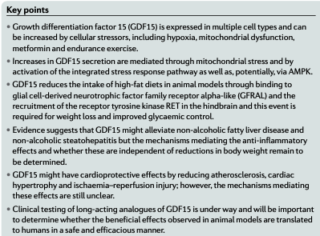
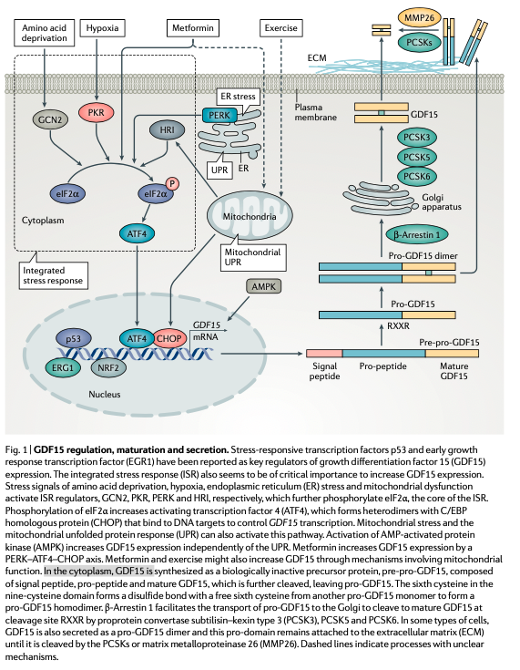
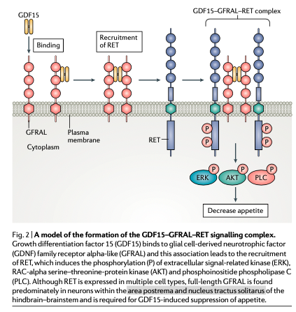

```{r setup, include=FALSE}
knitr::opts_chunk$set(echo = TRUE)
```

# Title: GDF15 emerging biology and therapeutic applications for obesity and cardiometabolic disease
# Abstract
 * TGF$\beta$ superfamily
 * stress, exercise, and metformin lead to increase in GDF15
 * GDF15 & GFRAL are independent of other appetite hormones
 
```{r Data_Insert, include=FALSE}
library(readxl)
library(knitr)
plasmaMin <- 0.1
plasmaMax <- 1.2
Old <- read_excel("~/OneDrive - University of Pittsburgh/Jurczak lab/Jake/Young-vs-Old-Summary-01.22.21.xlsx",
range = "A16:AA29")
Young <- read_excel("~/OneDrive - University of Pittsburgh/Jurczak lab/Jake/Young-vs-Old-Summary-01.22.21.xlsx",
range = "A1:AA14")


```
 
# Introduction
  * Obesity-->NAFLD & Insulin Resistance--> T2DM
  * GDF15
    + ~40kDa :~25 kDa homodimer
    + 308AA: 112 AA w Disulfide linkage
  * Expressed
    + Liver, Intestine, Kidney, and placenta
  * GDF15 increase in obesity
  * GDF15 inversely related with body mass in nonobese peeps
  * GDF15 is not causing obesity but rather Increased levels of
GDf15 are a consequence of obesity. Both nonobese and pregnant moms weight less when they have more GDF15. People who take weight loss drugs have more GDF15. 
  * GDF15 levels are at `r plasmaMin` to `r plasmaMax` (ng/mL)
    + GDF15 old mice have 0.25 ng/mL
    + GDF15 young mice have 0.17 ng/mL
    
```{r}
mean(Old$`Plasma GDF15 (pg/mL)`)
mean(Young$`Plasma GDF15 (pg/mL)`)
t.test(Old$`Plasma GDF15 (pg/mL)`,Young$`Plasma GDF15 (pg/mL)`)

```
## Summary Key Points 
[Uniprot](https://www.uniprot.org/uniprotkb?query=Gdf15)
[GTEx](https://gtexportal.org/home/gene/GDF15)
Looks like GDF15 in humans and mice is from exon 3 and five. Canonical trascript is 308AA (ENST00000252809.3 or NM_004864.4). Mice is 60.34% similar to Human. Both have a signal sequence of 29 AA (human) and 30AA (mice).
[comparison](https://www.uniprot.org/align/clustalo-R20220923-002045-0707-74024199-p1m/overview)
```{r Key_Points, echo=FALSE}

```

### Tissue Expression
 * *Gdf15 is expressed in healthy mice in the following order: Kidney>Liver>WAT>BAT>skeletal muscle*
* *Gdf15 is expressed in Obese mice in the following order: Liver>WAT>BAT get to levels in the kidney*

### Regulating Gdf15
 * transcription factors like p53 (tumor supressor) & EGRI: more Gdf15
 * Integrated stress response: more stress leads to phosphorylated eIF2$\alpha$, which inhibits global general protein synthesis. Leads to increase in Atf4, which helps cells adapt to stress. 
 * Mito UPR increases CHOP and Atf4.
 *GDF15 might be explaining why insulin resitance doesnt occur in people with mito UPR
 * AMPK is independent of UPR (doesnt need CHOP) to increase Gdf15/. WHy if the cell knows that it needs more energy, would it signal AMPK to increase GDF15 to stop eating. 
 
```{r Gdf15_regulation}

```
 
 
 
 
 
 
### Gdf15 maturation
 * starts at 40 kDa--> signal sequence cut 30 kDa (pro)-->13 kDA (mature)-->homodimers (25-26 kDa)

### GFRAL signaling
 * GFRAL does not bind to other TGF$\beta$ superfamily
 * Needs receptor tyrosine kinase called RET (51>9,43)
 * GFRAL only expressed in hindbrain-brainstem (area postema & nucleus tractus solitarus) & BWAT. But no protein in BWAT. 
 * Mice have a GFRAL splicing variant
 * What is wrong with recombinant GDF15?
```{r}

```

