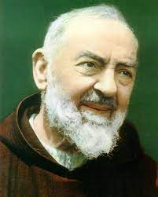
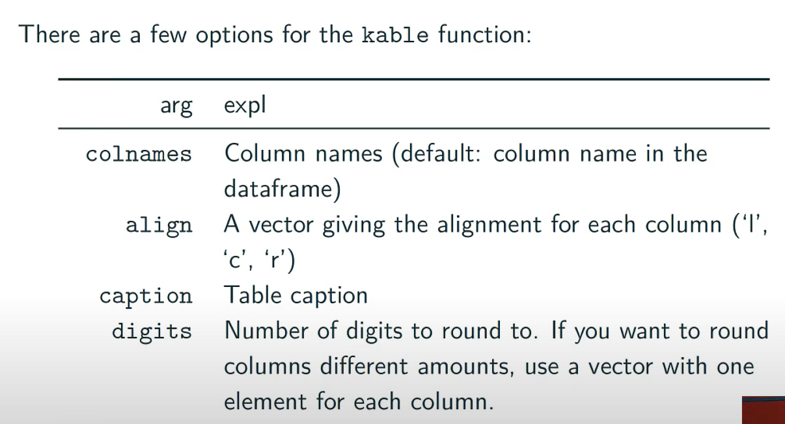

```{r setup, include=FALSE}
knitr::opts_chunk$set(echo = TRUE)
```
# RM Basics
### Shortcuts
[RMarkdown](https://www.rstudio.com/wp-content/uploads/2015/02/rmarkdown-cheatsheet.pdf)
```{r shortcuts}
# option -: inserts <- 
# command option I: inserts a new chunk
# command shift m: %>% 
# command shift enter: run current chunk
# command enter: run line in console
# setwd by going to session-->set working directory--> to source. Thus makes life easier.
```


```{r `r`}
myname <- "Jake Kastroll"
# setting up a variable for text below
```

My name is `r myname`

### Equations
 Here is an equation $$E(y)=x $$
[Math](https://www.codecogs.com/eqnedit.php)

### Figures
```{r Figures}
library(knitr)

```


* Save image in reproducible manner
1.
  + pdf()
  + code for image
  + dev.off()
2. 
  + ggsave
  
### Table
```{r}
# kable()
library(knitr)

```


# R Basics
 + **na.rm = T** will allow calculations even with NA values.
 + **names** (object) <- c("name1","name2") will allow naming 
 + x <- c(four=4, five=5, one =1) will name and set in one step
 + **grep("",a$?)**: find "" within specific row or column
 + **which()**: returns position
 + **subset()** or a[,]: returns subset of vector or data frame
 + **paste0(,)**: paste together two objects
 + t <- table(a$aff,a$trait,**useNA = "always"**)
 + **kable**(t,caption = "Case Control Study"): nice table
 + a %>% **mutate**(lifeExp = **replace**(lifeExp, (year==1957), 69.96))
 + *apply()* family: over dataframe (use tapply for mean of many groups)
 
##### Factors 
 +  a1 <- a$all2; **levels(a1)** <- c(levels(a1),"C"); levels(a1): this adds a level
 + levels(g.f) <- c("T/T","A/T","A/A"): naming levels
 + a1 <- **factor(a$all1)**: drop unused levels
 
##### Genetics
+ library(genetics); **genotype(a$all1,a$all2)**

##### Strings
+ **length()**: returns elements in a string
+ **nchar()**: returns number of characters in character

###### stringr
 + **str_length(x)**: same as nchar()
 + **str_c("X","Y","Z",sep=" ")**: like paste and paste0
 + **str_sub()**: returns subsection of string
 + **str_split(s,' ',simplify=TRUE)**: splits 
 + **str_trim(" AG ")**: no white spaces
 + **str_detect**: df %>% 
  filter(str_detect(word, "x$")): filter out based upon detection
 + [Stringr](https://r4ds.had.co.nz/strings.html)  
 + [str_cheatsheet](https://evoldyn.gitlab.io/evomics-2018/ref-sheets/R_strings.pdf)  
 
##### Functions
swag <- function (swagy){
Body swagy
Return ()
}


###### Debug
+ **browser()**: R interpreter, use c to continue, n for new line, and Q to quit. 
+ **options(error=recover)** then **options(error=null)**: same as Debug but lets you choose which function. 

# TidyVerse
 + a %>% **filter** (all1=="G"): kinda like subset () or a[,]
 + **recode** (a$g, `1`='T/T',`2`='A/T',`3`='A/A'): change the way objects are layed out.
 + a %>% **arrange(t)** : like a[order(a$t),]
 + a %>% **select**(aff,g): like a[,c("aff","all1")]
 + **%in%** : match of the thing preceding the symbol

# dplyr
+ *tbl_df()*: special df that wraps
+ *select()*: exactly like df[,c("",""...)]. Can use column_name1:column_name5
+ *filter*: filter(d_df, Pi > 16, percent.GC > 80) like 
d[d$Pi > 16 & d$percent.GC > 80, ]
+ *arrange()*: arrange(d_df, desc(total.SNPs), desc(depth))
+ *mutate()*: d_df <- mutate(d_df, diversity = Pi/(10*1000))
+ *%>%* :d_df %>% filter(percent.GC > 40) is filter(d_df, percent.GC > 40
+ *groupby()*: mtfs_df %>% group_by(chr): groups by rows
+ *summarize()*: create a table of you name it.
